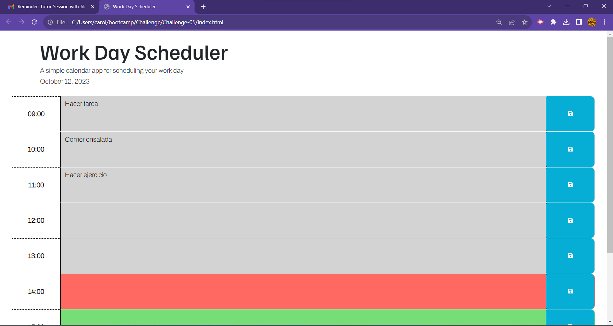

# Challenge-05
This repository codes for a Work Day Scheduler. It shows the current day, let save events from 9:00 to 17:00, and also it clarifies what the current hour, and which are past and future hours. 

 IMAGE IN ASSESTS FOLDER

https://ambersanti1.github.io/Challenge-05/

